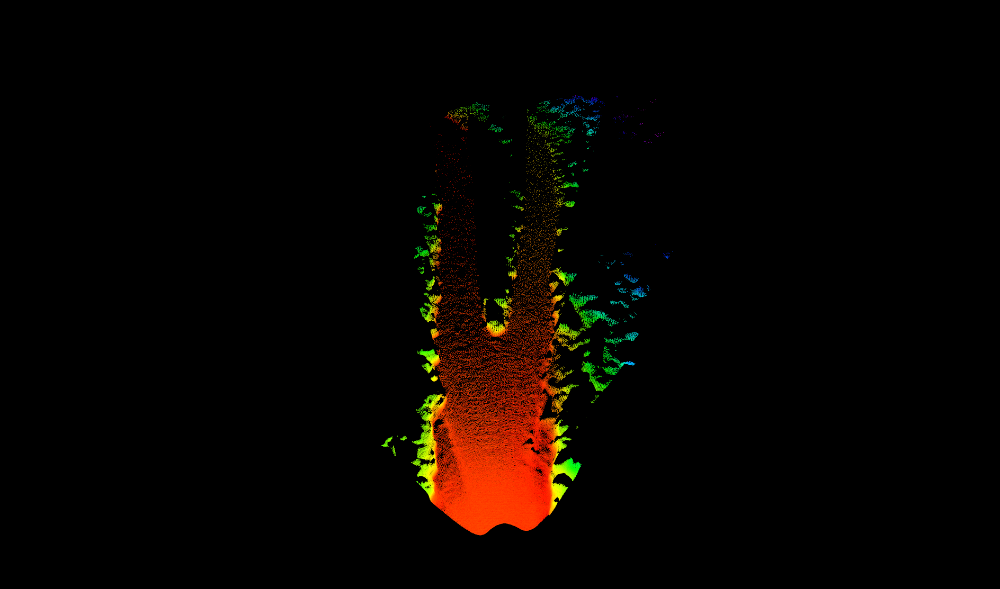

# Create livox Solid-state Lidar sensor in Carla (including carla-ros-bridge adaptation)
## System version Ubuntu 20.04LTS
## ROS version Noetic
## CARLA version 0.9.12
## Reference
[CARLA-0.9.12](https://carla.readthedocs.io/en/0.9.12/) 
&
[livox_laser_simulation](https://github.com/Livox-SDK/livox_laser_simulation)

## Release version [CARLA_0.9.12_release](https://pan.baidu.com/s/13jVmsSYXZfmdeD4TttYO-A) ExtractionCode 1234

# Major contribution
+ Simulate the livox lidar, including the line number and intensity of livox.
+ New attribute *float* `decay_time`. Control the reading frequency of lidar csv files. The larger the value, the more points will be read.
+ New attribute *float* `lidar_type`. Simulation of different types of livox lidar.
    >0.0-Horizon
    1.0-Mid40
    2.0-Avia
    3.0-Tele
+ Original attribute `dropoff_intensity_limit` and `dropoff_zero_intensity`will not be available (because of the livox-intensity)

## Configure the main CPP files
+ Use the files in the `Unreal` folder to replace or modify the files in the `carla` home directory
## Configure the serializer/data files
+ Use the files in the `LibCarla` folder to replace or modify the files in the `carla` home directory
## Configure PythonAPI
+ Use the files in the `PythonAPI` folder to replace or modify the files in the `carla` home directory
## Configure ROS-BRIDGE
+ Update the files in `carla-ros-bridge`
## Configure livox_csv files
+ Put the `LivoxCsv` folder in the **/home** directory and change its permission to *user*
+ This file contains the exit angle (azimuth / zenith angle) and timestamp of different lidar at each point in 4 seconds officially given by Livox
## Launch
```
cd ~/carla
make clean
make PythonAPI
make launch
```

# Analysis of real point cloud and simulated point cloud (taking Horizon lidar as an example)
+ Horizon lidar will generate 6 scanning points each time, and its line number is 0 to 5
+ When the scanning of point 5 is completed, the next group of scanning will be started next to position 0 again
+ Scanning diagram of real point cloud:

+ Scanning diagram of simulation point cloud:

+ point cloud distribution in CSV file:


# Comparison between simulation point cloud and actual point cloud
+ Create a custom map in Carla using real scene data
+ At the same location, collect the real-world point cloud and the simulation point cloud in the carla map respectively
+ Real horizon point cloud scanning(rviz):

+ Simulation horizon point cloud scanning(rviz):

+ Real lidar point cloud with 5 decay time：

+ Simulation lidar point cloud with 5 decay time：


# SLAM by simulation point cloud
+ Using [livox_horizon_loam](https://github.com/Livox-SDK/livox_horizon_loam) to build map in `Town_03`, the effect is as follows:

