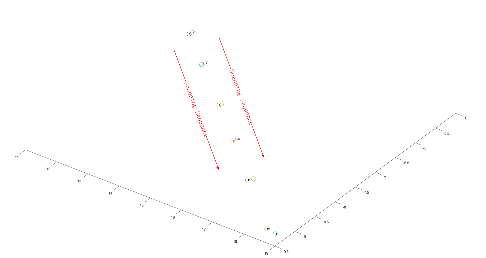
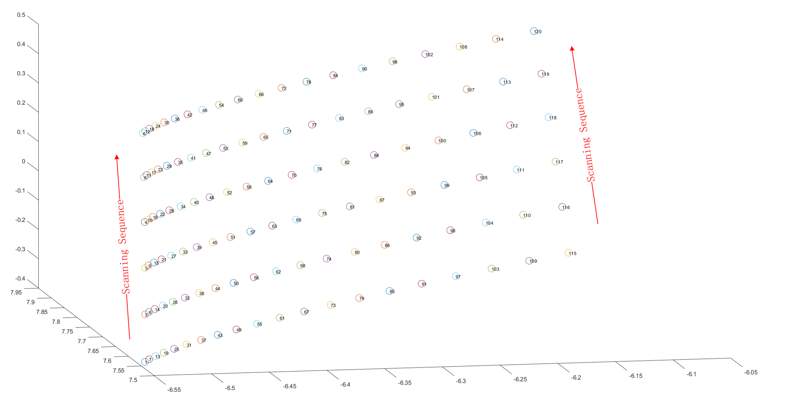
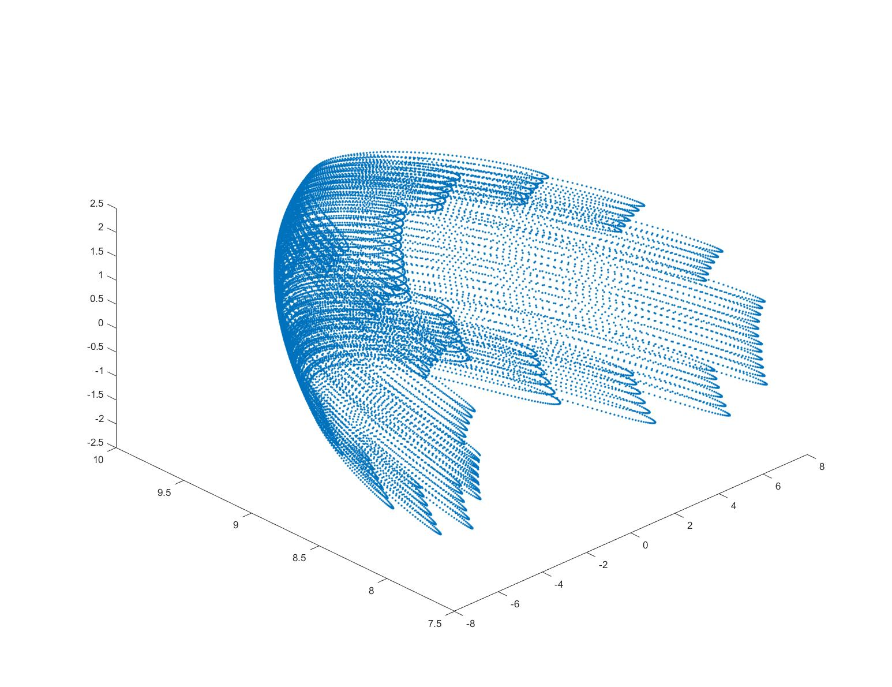
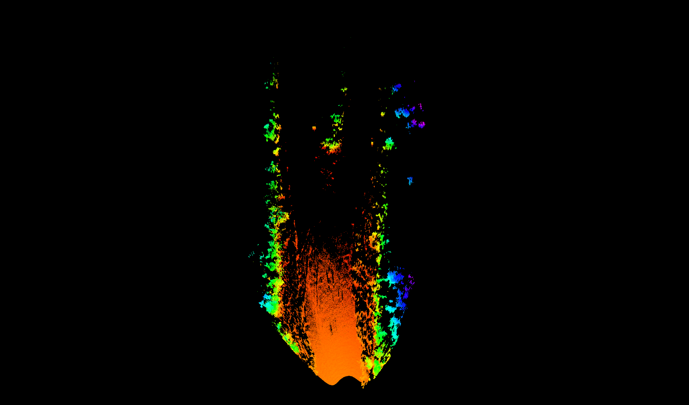
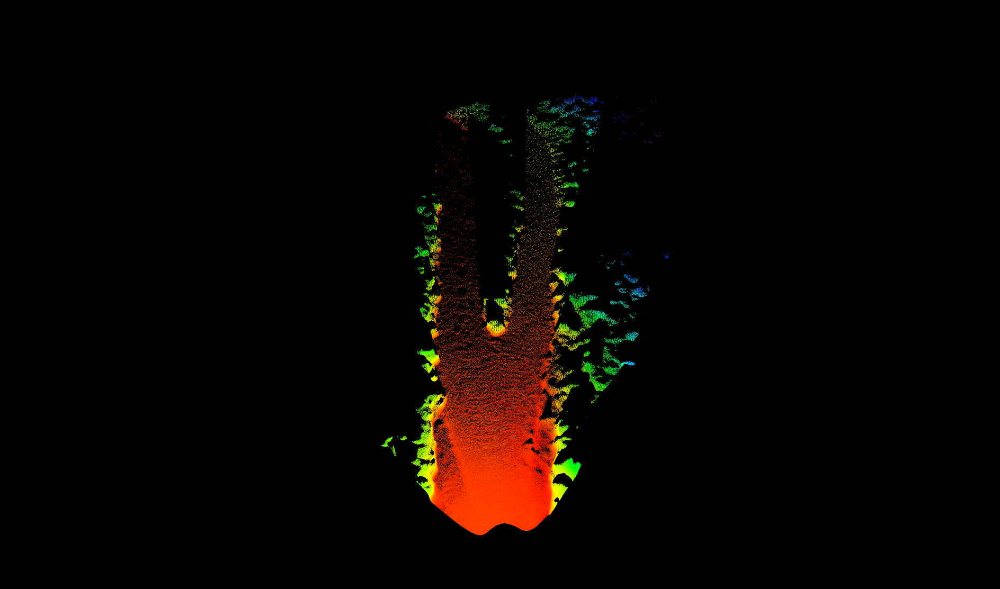
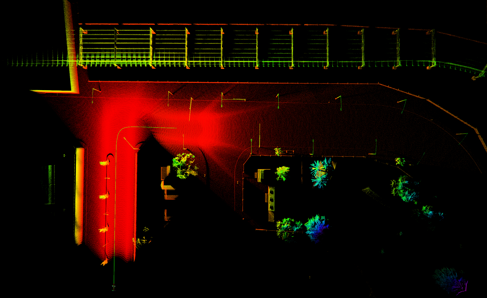

# 在CARLA中创建Livox固态雷达仿真传感器（包含ros-bridge适配）
## 系统版本 Ubuntu20.04LTS
## ROS版本 Noetic
## CARLA版本 0.9.12
## 参考1 [CARLA-0.9.12](https://carla.readthedocs.io/en/0.9.12/) 
## 参考2 [livox_laser_simulation](https://github.com/Livox-SDK/livox_laser_simulation)
## Release版 [CARLA_0.9.12_release](https://pan.baidu.com/s/13jVmsSYXZfmdeD4TttYO-A) 提取码 1234
---
# 主要贡献
+ 对livox雷达进行仿真，包括对线号和intensity的仿真
+ 新增属性 float `decay_time`。控制csv文件读取频率，数值越大，读取点数量越多。在`delta time = 0.05， decay_time = 0.8`时仿真点云量与真实雷达点云量相近（4-5MB/s）
+ 新增属性 float `lidar_type`。对不同型号的livox雷达进行仿真
    >0.0-Horizon
    1.0-Mid40
    2.0-Avia
    3.0-Tele
+ 原有属性 `dropoff_intensity_limit`，`dropoff_zero_intensity`失效（由于采用了livox自定义的intensity计算方式)
+ 原有属性 `dropoff_general_rate`仍可对点云进行按比例随机抛弃

## 配置主要实现文件
+ 将`Unreal`文件夹中文件与`carla`主目录中文件进行替换或修改

## 配置数据流文件
+ 将`LibCarla`文件夹中文件与`carla`主目录中文件进行替换或修改

## 配置PythonAPI
+ 将`PythonAPI`文件夹中文件与`carla`主目录中文件进行替换或修改

## 配置ROS-BRIDGE
+ 将`carla-ros-bridge`中文件进行相应更新

## 配置livox_csv文件
+ 将`LivoxCsv`文件夹放入/home目录下，并将其权限改为用户
+ 该文件包含由Livox官方给出的不同激光雷达在4秒内每个点的出射角度（方位角/天顶角）和时间戳

## 启动

```
cd ~/carla
make clean
make PythonAPI
make launch
```

---
# 真实点云与仿真点云解析（以Horizon雷达为例）
+ horizon雷达每次扫描会产生6个扫描点，其线号编号为0-5
+ 当5号点扫描完毕后，会再次从0号位置旁边开始进行下一组扫描
+ 真实点云扫描效果图：

+ 仿真点云扫描效果图：

+ csv文件中点云分布如图：


---
# 仿真点云（在CARLA中）与实际点云对比（真实场景和真实雷达）
+ 使用真实场景数据在CARLA中建立自定义地图
+ 在相同位置，分别采集真实世界horizon点云和仿真地图中horizon点云
+ 真实horizon点云扫描情况（rviz）

+ 仿真horizon点云扫描情况（rviz）

+ 真实雷达延时5s点云：

+ 仿真雷达延时5s点云：


---
# 仿真点云SLAM
+ 使用[livox_horizon_loam](https://github.com/Livox-SDK/livox_horizon_loam)，在`Town_03`中进行建图，效果如下：

